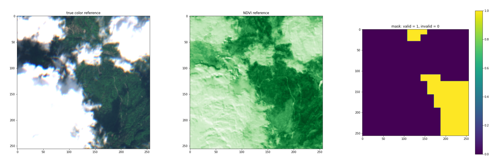

## Treecurrent
This example showcases the prediction of vegetation growth using a recurrent network and `eolearn`.
Using eight consecutive observations with at least two weeks time difference as input,
a Convolutional LSTM predicts the **NDVI** of the 9th observation.

The input data consists of patches of southern Bavaria:
- 256x256 pixel @ 10m resolution
- bands B02, B03, B04, B08, B8A, B11
- train: blue | val: green | test: red

The NDVI references are calculated from bands B04 and B08. Additionally, masks for the 
reference are created in order to only back-track gradients from non-cloudy and valid 
pixels.

