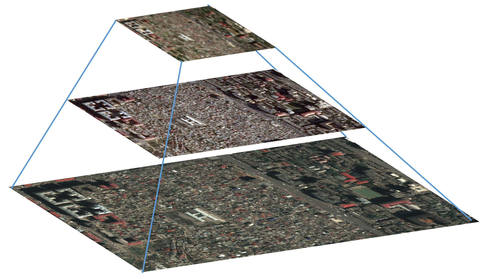
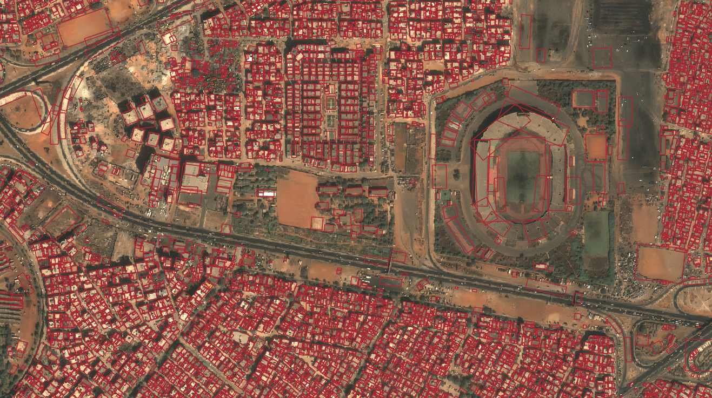
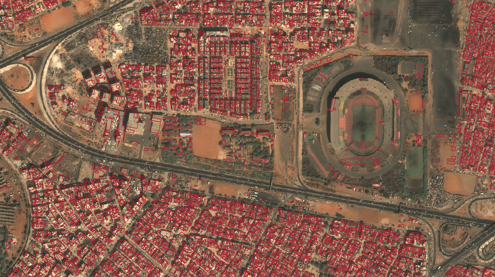
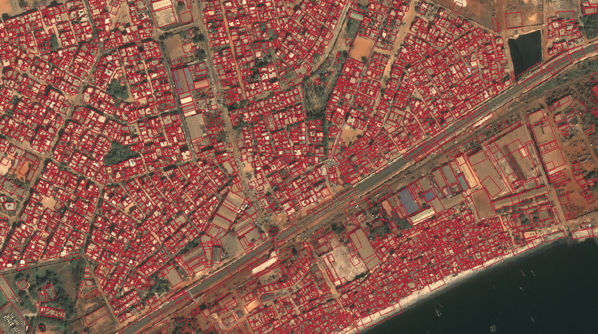
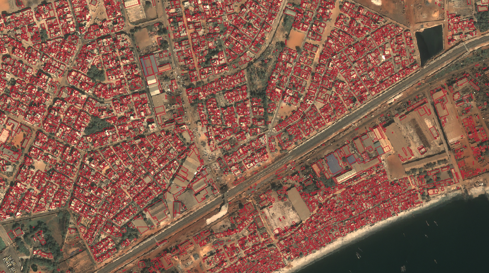
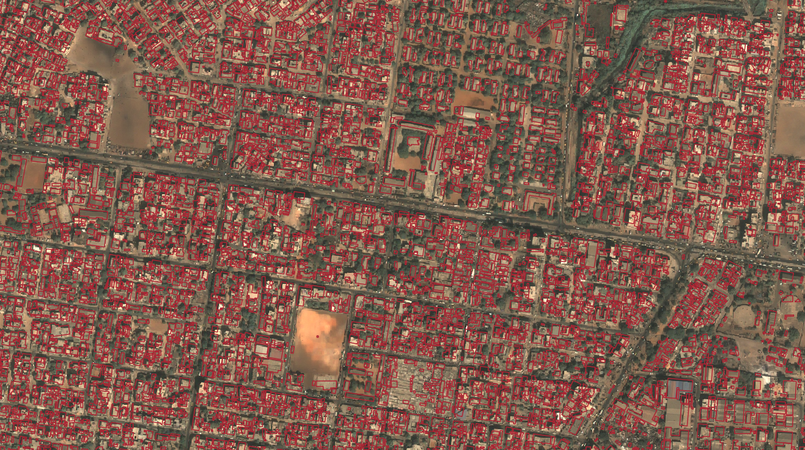

# HIECTOR: HIErarchical object deteCTOR 

Repository to showcase the hierarchical building detection code available at [sentinel-hub/hiector](https://github.com/sentinel-hub/hiector). 

The code in the `HiectorInference.ipynb` notebook allows to execute building detection at large scale using multi-scale satellite imagery. In this example, Sentinel-2, Airbus SPOT and Airbus Pleiades imagery will be used to detect buildings in Dakar, Senegal.

Pre-trained models and labels are open-source and available on the AWS S3 bucket [queryplanet.sentinel-hub.com](http://queryplanet.sentinel-hub.com/index.html). The results shown in the notebook are exemplary and are obtained with models fine-tuned on the small sample of manually validated building footprints. The models are released under [CC BY-NC 4.0](https://creativecommons.org/licenses/by-nc/4.0/) license, while the `hiector` code is available under [MIT](https://opensource.org/licenses/MIT) license.

## Overview

 The aim of this tool is to apply object detection on satellite imagery of varying spatial resolutions in a hierarchical fashion. The prototype developed uses Sentinel-2, Airbus SPOT and Airbus Pleiades as data sources for a hierarchical detection at three spatial scales. The core idea is to execute the detection of built-up areas using Sentinel-2 imagery first, to define polygons where SPOT imagery would be requested. At the second level of the pyramid, the detection is executed on SPOT imagery to determine large-to-medium sized buildings, and areas of low confidence where small and dense buildings are located. On those areas, Pleiades imagery would be requested and object detection performed to delineate the smallest buildings. 

The hierarchical approach is based on the assumption that the majority of man-made objects of interest, e.g. buildings, bridges, airplanes, are very sparse in nature and applying object detection on Very High Resolution at large-scale is inefficient and very costly.

To facilitate the generalization and application of the task different scales we formulate the task as the detection of oriented objects, with the direct estimation of oriented bounding boxes. We use the [_Single-Stage Rotation-Decoupled Detector for Oriented Object_](https://github.com/Capino512/pytorch-rotation-decoupled-detector) architecture and a pre-trained ResNet34 backbone to train a model on Sentinel-2 imagery and a joint model on Pleiades/SPOT imagery. 

The models were trained and evaluated on a national scale in a middle-eastern country. Quantitative evaluation of HIECTOR on a large scale allowed to characterise the cost-saving benefits of the approach with respect to the detection accuracy. These models were fine-tuned on a small set of manually created labels in Dakar, Senegal and openly distributed [here](http://queryplanet.sentinel-hub.com/index.html). Along with the fine-tuned models, you can also download the manually created building footprints.

The table below shows results obtained with the fine-tuned models on a small set of buildings (i.e. ~8000) using Airbus SPOT and Pleiades imagery. For reference, the last column reports results for the [Open Buildings](https://sites.research.google/open-buildings/) dataset. For this dataset, it is unknown which imagery they were produced with and for which time period.

| Airbus Pleiades | HIECTOR | Open Buildings  |
|:----------------|:--------|:-----------------------------------------------------------------|
|  |  |  |
|  |  |  |
|  |  |  |

## Requirements

Before running the notebook make sure to check out the instructions in the [sentinel-hub/hiector](https://github.com/sentinel-hub/hiector) repo and its [requirements](https://github.com/sentinel-hub/hiector/requirements.txt). 

After installing the requirements with `pip install -r requirements.txt`, code for the Non-Max Suppression algorithm needs to be compiled for either CPU or GPU.

To run the example notebook you need a Sentinel Hub account, which you can get [here](https://services.sentinel-hub.com/oauth/subscription). Free trial accounts are available.

As the tool is meant to be run on large-scale, it is designed to use [Amazon Web Services](https://aws.amazon.com/) to store the data and parallelize the processing over multiple instances. However, the notebook can be run locally using either CPU or GPU acceleration.

## Blog posts

We will soon publish blog-posts to detail both the training and inference procedures.

## Acknowledgements

Project funded by [ESA](https://www.esa.int/About_Us/ESRIN) [Philab](https://philab.phi.esa.int/) through the QueryPlanet 4000124792/18/I-BG grant.

## Questions

If you have any comment or question please get in touch at _eoresearch@sinergise.com_.